# 财务报销SaaS系统 - AI 上下文文档

> 本文档由 AI 上下文初始化工具自动生成和维护，为 AI 助手提供项目概览和导航。

---

## 变更记录 (Changelog)

| 日期 | 操作 | 说明 |
|------|------|------|
| 2025-01-27 | 初始化 | 创建项目级和模块级 AI 上下文文档 |

---

## 项目愿景

本系统是一个面向企业客户的**多租户财务报销SaaS平台**，提供完整的报销管理、借款管理、还款管理、审批流程等核心功能。系统采用微服务架构，支持多租户隔离，可扩展的插件化设计，以及灵活的工作流引擎。

### 核心价值
- **多租户SaaS架构**：支持多个企业/组织独立使用系统，数据完全隔离
- **灵活的审批流程**：基于 Camunda 工作流引擎，支持自定义审批流程
- **插件化设计**：报销类型可扩展，通过插件机制支持不同业务场景
- **完整的财务闭环**：报销、借款、还款形成完整的财务流程

---

## 架构总览

### 技术栈

| 类别 | 技术 | 版本 |
|------|------|------|
| 开发语言 | Java | 17 |
| 框架 | Spring Boot | 3.2.0 |
| 微服务 | Spring Cloud | 2023.0.0 |
| 服务发现 | Nacos | 2.2.3 |
| 数据库 | PostgreSQL | 15 |
| ORM | MyBatis-Plus | 3.5.4.1 |
| 工作流引擎 | Camunda | 8.3.0 |
| 缓存 | Redis | 7 |
| 消息队列 | RabbitMQ | 3.12 |
| 对象存储 | MinIO | Latest |
| 网关 | Spring Cloud Gateway | - |

### 模块结构图

```mermaid
graph TD
    ROOT["财务报销SaaS系统"]

    ROOT --> COMMON["common (公共模块)"]
    COMMON --> C1["common-core"]
    COMMON --> C2["common-web"]
    COMMON --> C3["common-security"]
    COMMON --> C4["common-tenant"]
    COMMON --> C5["common-plugin"]
    COMMON --> C6["common-workflow"]
    COMMON --> C7["common-mq"]
    COMMON --> C8["common-feign"]

    ROOT --> SERVICES["services (微服务)"]
    SERVICES --> S1["tenant-service"]
    SERVICES --> S2["user-service"]
    SERVICES --> S3["org-service"]
    SERVICES --> S4["trans-service"]
    SERVICES --> S5["loan-service"]
    SERVICES --> S6["repayment-service"]
    SERVICES --> S7["approval-service"]
    SERVICES --> S8["notification-service"]
    SERVICES --> S9["report-service"]
    SERVICES --> S10["file-service"]

    ROOT --> GATEWAY["gateway (网关)"]
    GATEWAY --> GW1["gateway-service"]

    ROOT --> ADMIN["admin (管理端)"]
    ROOT --> CLIENT["client (客户端)"]

    click C1 "./common/common-core/CLAUDE.md" "查看 common-core 模块"
    click C2 "./common/common-web/CLAUDE.md" "查看 common-web 模块"
    click C3 "./common/common-security/CLAUDE.md" "查看 common-security 模块"
    click C4 "./common/common-tenant/CLAUDE.md" "查看 common-tenant 模块"
    click C5 "./common/common-plugin/CLAUDE.md" "查看 common-plugin 模块"
    click C6 "./common/common-workflow/CLAUDE.md" "查看 common-workflow 模块"
    click C7 "./common/common-mq/CLAUDE.md" "查看 common-mq 模块"
    click C8 "./common/common-feign/CLAUDE.md" "查看 common-feign 模块"

    click S1 "./services/tenant-service/CLAUDE.md" "查看 tenant-service 模块"
    click S2 "./services/user-service/CLAUDE.md" "查看 user-service 模块"
    click S3 "./services/org-service/CLAUDE.md" "查看 org-service 模块"
    click S4 "./services/trans-service/CLAUDE.md" "查看 trans-service 模块"
    click S5 "./services/loan-service/CLAUDE.md" "查看 loan-service 模块"
    click S6 "./services/repayment-service/CLAUDE.md" "查看 repayment-service 模块"
    click S7 "./services/approval-service/CLAUDE.md" "查看 approval-service 模块"
    click S8 "./services/notification-service/CLAUDE.md" "查看 notification-service 模块"
    click S9 "./services/report-service/CLAUDE.md" "查看 report-service 模块"
    click S10 "./services/file-service/CLAUDE.md" "查看 file-service 模块"

    click GW1 "./gateway/gateway-service/CLAUDE.md" "查看 gateway-service 模块"
```



---

## 模块索引

### 公共模块 (common/)

| 模块 | 职责 | 状态 |
|------|------|------|
| [common-core](./common/common-core/CLAUDE.md) | 核心工具类、异常处理、统一返回格式 | 已实现 |
| [common-web](./common/common-web/CLAUDE.md) | Web配置、拦截器、跨域处理 | 已实现 |
| [common-security](./common/common-security/CLAUDE.md) | JWT认证、安全配置、用户信息 | 已实现 |
| [common-tenant](./common/common-tenant/CLAUDE.md) | 多租户上下文、租户拦截器 | 已实现 |
| [common-plugin](./common/common-plugin/CLAUDE.md) | 插件化架构、动态表单引擎 | 已实现 |
| [common-workflow](./common/common-workflow/CLAUDE.md) | Camunda工作流引擎集成 | 已实现 |
| [common-mq](./common/common-mq/CLAUDE.md) | 消息队列封装 | 已实现 |
| [common-feign](./common/common-feign/CLAUDE.md) | Feign客户端封装 | 已实现 |

### 微服务模块 (services/)

| 模块 | 端口 | 职责 | 状态 |
|------|------|------|------|
| [tenant-service](./services/tenant-service/CLAUDE.md) | 8080 | 租户管理、租户注册、配额控制 | 已实现 |
| [user-service](./services/user-service/CLAUDE.md) | 8762 | 用户管理、认证授权、钉钉集成 | 已实现 |
| [org-service](./services/org-service/CLAUDE.md) | - | 组织架构管理、组织树 | 已实现 |
| [trans-service](./services/trans-service/CLAUDE.md) | 8764 | 报销单管理、报销审批 | 已实现 |
| [loan-service](./services/loan-service/CLAUDE.md) | - | 借款管理、借款审批 | 已实现 |
| [repayment-service](./services/repayment-service/CLAUDE.md) | - | 还款管理、冲销结算 | 已实现 |
| [approval-service](./services/approval-service/CLAUDE.md) | 8767 | 审批流程管理 | 已实现 |
| [notification-service](./services/notification-service/CLAUDE.md) | 8768 | 通知管理、消息推送 | 已实现 |
| [report-service](./services/report-service/CLAUDE.md) | - | 报表统计、数据导出 | 已实现 |
| [file-service](./services/file-service/CLAUDE.md) | - | 文件上传、MinIO集成 | 已实现 |

### 网关模块 (gateway/)

| 模块 | 端口 | 职责 | 状态 |
|------|------|------|------|
| [gateway-service](./gateway/gateway-service/CLAUDE.md) | 9200 | API网关、路由转发、租户识别 | 已实现 |

---

## 服务器信息

### 远程部署服务器

| 项目 | 值 |
|------|-----|
| 地址 | 10.101.1.90 |
| 端口 | 22 |
| 用户名 | admin |
| 密码 | `EnablingSoft@2025` |

> **注意**: 密码认证可能被禁用，如需使用 SSH 密钥请联系管理员配置

---

## 运行与开发

### 环境准备

1. **启动基础设施** (使用 Docker Compose)
   ```bash
   docker-compose up -d
   ```
   这将启动：PostgreSQL、Redis、RabbitMQ、Nacos、MinIO、Camunda

2. **配置本地环境**
   - 复制 `application-local.yml` 模板（如需要）
   - 确保数据库连接配置正确

### 启动服务

**启动顺序**：
1. 启动 Nacos (Docker)
2. 启动 Gateway
3. 启动各微服务（任意顺序）

```bash
# 启动网关
cd gateway/gateway-service && mvn spring-boot:run

# 启动租户服务
cd services/tenant-service && mvn spring-boot:run

# 启动用户服务
cd services/user-service && mvn spring-boot:run

# ... 其他服务
```

### 开发工具

- **IDE**: IntelliJ IDEA 推荐
- **JDK**: OpenJDK 17+
- **Maven**: 3.8+
- **Git**: 默认分支策略为 PR 合入主分支

---

## 测试策略

### 单元测试
- 使用 `spring-boot-starter-test`
- 测试容器支持：`testcontainers`

### 集成测试
- 使用 Testcontainers 进行数据库集成测试
- Mock 外部服务调用

### 测试运行
```bash
mvn test
```

---

## 编码规范

### Java 代码规范
- 使用 Lombok 简化代码
- 使用 MapStruct 进行对象映射
- 统一异常处理：`GlobalExceptionHandler`
- 统一返回格式：`Result<T>`

### 命名约定
- 包名：`com.fs.{module}`
- Controller：`*Controller`
- Service：`*Service` / `*ServiceImpl`
- Mapper：`*Mapper` (MyBatis)
- Entity：`*` / `*Entity`

### 多租户开发规范
- 所有业务表必须包含 `tenant_id` 字段
- 使用 `TenantContextHolder` 获取当前租户
- 外键约束必须包含 `tenant_id`
- 索引以 `tenant_id` 为第一列

---

## AI 使用指引

### 推荐工作流程

1. **修改前先阅读模块文档**：查看目标模块的 `CLAUDE.md`
2. **遵循多租户原则**：确保所有数据操作都包含租户隔离
3. **使用统一异常处理**：抛出 `BusinessException` 而非直接抛出异常
4. **保持API一致性**：使用 `Result<T>` 包装返回值

### 常见任务

#### 添加新的微服务
1. 复制现有服务模块作为模板
2. 修改 `pom.xml` 中的 artifactId
3. 修改 `application.yml` 中的服务名和端口
4. 在根 `pom.xml` 的 `<modules>` 中添加新模块
5. 在 Gateway 配置中添加路由规则

#### 添加新的报销类型插件
1. 在 `common-plugin` 模块创建插件类
2. 实现 `TransTypePlugin` 接口
3. 在 `TransTypePluginManager` 中注册插件
4. 配置动态表单 Schema

#### 调整审批流程
1. 使用 Camunda Modeler 设计 BPMN 流程
2. 部署流程定义到 Camunda
3. 在业务代码中启动流程实例
4. 配置任务监听器处理审批事件

### 重要提示
- **不要提交敏感信息**：密码、密钥等应使用配置文件或环境变量
- **代码提交采用PR方式**：CI通过后才允许合入主分支
- **多租户字段不可遗漏**：新增表时必须包含 `tenant_id`
- **软删除优先**：重要业务表使用 `deleted_at` 而非物理删除

---

## 相关文档

- [微服务架构详细设计](./docs/architecture/微服务架构详细设计.md)
- [功能模块与数据库设计](./docs/architecture/功能模块与数据库设计.md)
- [工作流审批流程设计](./docs/architecture/工作流审批流程设计.md)
- [模块设计状态](./docs/architecture/模块设计状态.md)
