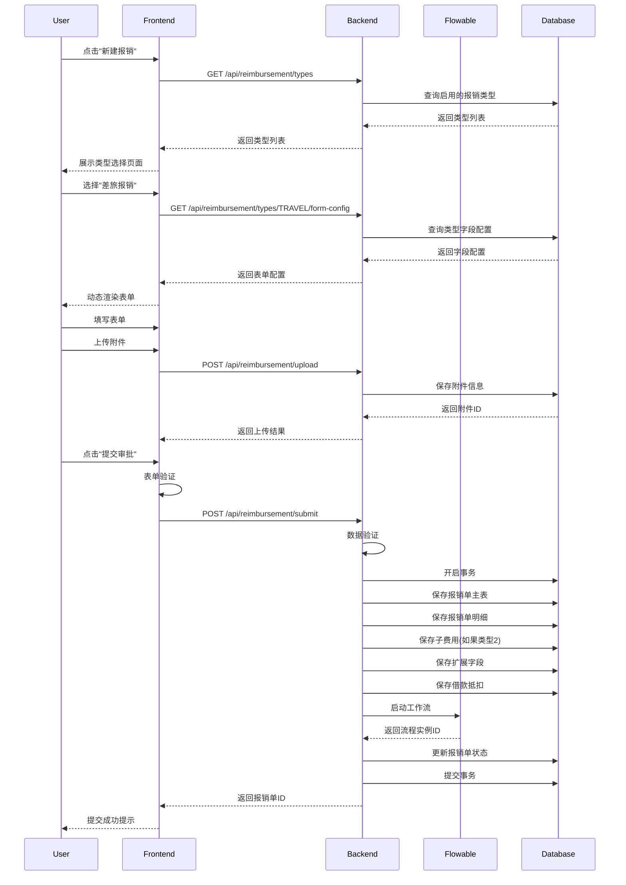
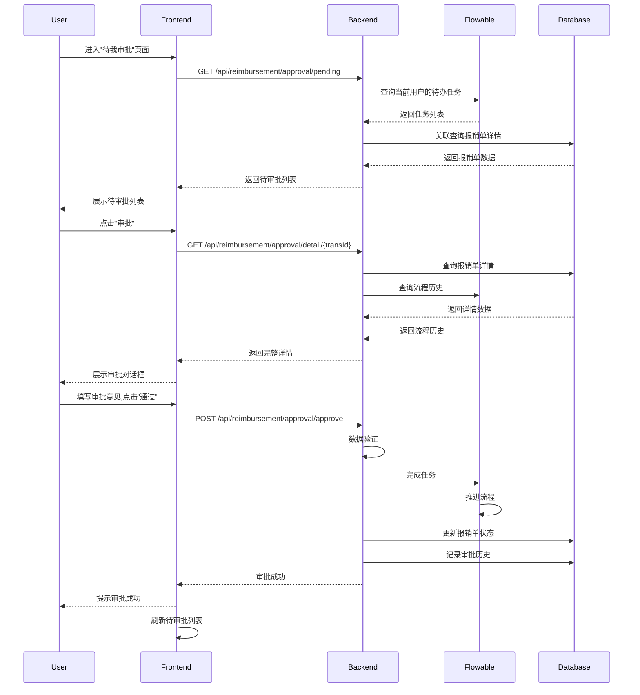

# 报销管理模块详细设计

## 📋 文档说明

**模块名称**: 报销管理 (Reimbursement Management)  
**模块代码**: TRANS  
**优先级**: P0 (核心功能)  
**版本**: v1.0  
**创建日期**: 2025-01-24  

---

## 📐 设计原则

### 1. 动态类型优先
- 报销类型必须可配置,无需代码修改即可新增、修改、启用/禁用
- 每种类型有独立的数据schema定义
- 类型支持字段级别的验证规则配置

### 2. 表单自动渲染
- 基于类型配置自动生成前端表单
- 支持多种字段类型: 文本、数字、日期、城市选择、明细表、附件等
- 支持字段级别的显示/隐藏控制
- 支持字段级别的联动逻辑

### 3. 数据一致性
- 原币金额 + 汇率 = 本币金额 (自动计算)
- 明细金额汇总 = 报销单总金额 (自动验证)
- 支持借款抵扣,自动计算剩余待支付金额

### 4. 多租户隔离
- 所有查询必须包含 `tenant_id`
- 报销类型配置支持租户级别的自定义
- 工作流配置支持租户级别的自定义

### 5. 插件化扩展
- 报销模块本身作为一个插件实现
- 支持类型级别的插件扩展
- 支持字段级别的插件扩展(自定义验证、自定义计算等)

---

## 🎯 功能概述

### 核心功能
1. **新建报销单** - 创建新的报销申请,支持6种报销类型
2. **待我审批** - 查看并审批分配给我的报销单
3. **我的报销** - 查看我提交的所有报销单
4. **已处理报销** - 查看已审批完成的报销单历史
5. **报销草稿** - 管理保存的草稿,支持继续编辑

### 6种报销类型

| 类型ID | 类型名称 | 类型代码 | 说明 |
|--------|----------|----------|------|
| 1 | 一般费用 | GENERAL | 通用报销类型,包含基本字段 |
| 2 | 差旅报销 | TRAVEL | 出差报销,包含行程信息+6类子费用 |
| 3 | 团建费用 | TEAM_BUILDING | 团队建设,包含建设月份 |
| 4 | 市内交通 | DOMESTIC_TRANSPORT | 市内交通费,类似一般费用 |
| 5 | 个人通讯 | PERSONAL_COMM | 个人通讯费,包含手机号码 |
| 6 | 业务活动 | BUSINESS_ACTIVITY | 业务活动费,类似一般费用 |

---

## 🗄️ 数据库设计

### 1. 报销类型配置表 (trans_type_config)

```sql
COMMENT ON TABLE trans_type_config IS '报销类型配置表 - 支持动态类型定义';

-- 字段类型枚举
CREATE TYPE field_type AS ENUM (
    'TEXT',            -- 文本
    'NUMBER',          -- 数字
    'DECIMAL',         -- 金额
    'DATE',            -- 日期
    'DATETIME',        -- 日期时间
    'SELECT',          -- 下拉选择
    'MULTI_SELECT',    -- 多选
    'CITY_SELECTOR',   -- 城市选择器
    'ORG_SELECTOR',    -- 组织选择器
    'PROJECT_SELECTOR',-- 项目选择器
    'USER_SELECTOR',   -- 用户选择器
    'CURRENCY_SELECTOR',-- 币种选择器
    'SUB_EXPENSE',     -- 子费用明细表
    'ATTACHMENT',      -- 附件上传
    'TEXTAREA',        -- 多行文本
    'RADIO',           -- 单选
    'CHECKBOX'         -- 复选框
);

-- 报销类型状态
CREATE TYPE trans_type_status AS ENUM (
    'ACTIVE',          -- 启用
    'DISABLED',        -- 禁用
    'ARCHIVED'         -- 归档
);

CREATE TABLE trans_type_config (
    -- 主键和租户ID
    tenant_id BIGINT NOT NULL,
    type_config_id BIGSERIAL NOT NULL,
    
    -- 基本信息
    type_code VARCHAR(50) NOT NULL,             -- 类型代码(GENERAL/TRAVEL等)
    type_name VARCHAR(100) NOT NULL,            -- 类型名称
    type_desc VARCHAR(500),                     -- 类型描述
    type_icon VARCHAR(100),                     -- 类型图标
    type_order INTEGER DEFAULT 0,               -- 排序
    
    -- 类型状态
    status trans_type_status NOT NULL DEFAULT 'ACTIVE',
    
    -- 扩展配置
    config JSONB,                               -- 扩展配置(存储类型级别的自定义配置)
    
    -- 审计字段
    created_by BIGINT,
    created_at TIMESTAMP NOT NULL DEFAULT CURRENT_TIMESTAMP,
    updated_by BIGINT,
    updated_at TIMESTAMP NOT NULL DEFAULT CURRENT_TIMESTAMP,
    
    -- 主键约束
    PRIMARY KEY (tenant_id, type_config_id),
    
    -- 唯一约束
    CONSTRAINT uk_trans_type_tenant_code UNIQUE (tenant_id, type_code),
    
    -- 外键约束
    CONSTRAINT fk_trans_type_tenant FOREIGN KEY (tenant_id) REFERENCES tenant(tenant_id)
);

-- 索引
CREATE INDEX idx_trans_type_code ON trans_type_config(type_code);
CREATE INDEX idx_trans_type_status ON trans_type_config(status);

-- 注释
COMMENT ON COLUMN trans_type_config.tenant_id IS '租户ID';
COMMENT ON COLUMN trans_type_config.type_config_id IS '类型配置ID';
COMMENT ON COLUMN trans_type_config.type_code IS '类型代码';
COMMENT ON COLUMN trans_type_config.type_name IS '类型名称';
COMMENT ON COLUMN trans_type_config.config IS '扩展配置(JSON格式)';
```

### 2. 报销类型字段配置表 (trans_type_field)

```sql
COMMENT ON TABLE trans_type_field IS '报销类型字段配置表 - 定义每种类型的字段';

-- 字段验证规则类型
CREATE TYPE validation_rule AS ENUM (
    'REQUIRED',        -- 必填
    'MIN_LENGTH',      -- 最小长度
    'MAX_LENGTH',      -- 最大长度
    'MIN_VALUE',       -- 最小值
    'MAX_VALUE',       -- 最大值
    'REGEX',           -- 正则表达式
    'CUSTOM',          -- 自定义验证
    'DATE_RANGE',      -- 日期范围
    'EMAIL',           -- 邮箱格式
    'PHONE'            -- 手机号格式
);

CREATE TABLE trans_type_field (
    -- 主键和租户ID
    tenant_id BIGINT NOT NULL,
    field_config_id BIGSERIAL NOT NULL,
    
    -- 关联类型
    type_config_id BIGINT NOT NULL,             -- 关联的类型配置ID
    
    -- 字段基本信息
    field_code VARCHAR(50) NOT NULL,           -- 字段代码(对应数据库列名)
    field_name VARCHAR(100) NOT NULL,           -- 字段显示名称
    field_type field_type NOT NULL,            -- 字段类型
    field_desc VARCHAR(500),                   -- 字段描述
    
    -- 字段属性
    is_required SMALLINT NOT NULL DEFAULT 0,    -- 是否必填
    is_readonly SMALLINT NOT NULL DEFAULT 0,    -- 是否只读
    is_visible SMALLINT NOT NULL DEFAULT 1,     -- 是否可见
    is_editable SMALLINT NOT NULL DEFAULT 1,    -- 是否可编辑(提交后)
    default_value VARCHAR(200),                 -- 默认值
    placeholder VARCHAR(200),                  -- 占位符
    
    -- 字段布局
    grid_col INTEGER DEFAULT 24,               -- 栅格列数(24栅格系统)
    form_group VARCHAR(100),                   -- 表单分组
    form_order INTEGER DEFAULT 0,               -- 表单排序
    
    -- 数据源配置(用于SELECT、CITY_SELECTOR等)
    data_source JSONB,                          -- 数据源配置
    
    -- 验证规则
    validation_rules JSONB,                    -- 验证规则(JSON数组)
    error_message VARCHAR(500),                 -- 错误提示
    
    -- 联动配置
    linkage_rules JSONB,                       -- 联动规则(JSON配置)
    
    -- 子表配置(仅用于SUB_EXPENSE类型)
    sub_table_config JSONB,                     -- 子表配置(子字段定义)
    
    -- 审计字段
    created_by BIGINT,
    created_at TIMESTAMP NOT NULL DEFAULT CURRENT_TIMESTAMP,
    updated_by BIGINT,
    updated_at TIMESTAMP NOT NULL DEFAULT CURRENT_TIMESTAMP,
    
    -- 主键约束
    PRIMARY KEY (tenant_id, field_config_id),
    
    -- 唯一约束
    CONSTRAINT uk_trans_type_field UNIQUE (tenant_id, type_config_id, field_code),
    
    -- 外键约束
    CONSTRAINT fk_trans_type_field_tenant FOREIGN KEY (tenant_id) REFERENCES tenant(tenant_id),
    CONSTRAINT fk_trans_type_field_type FOREIGN KEY (tenant_id, type_config_id) 
        REFERENCES trans_type_config(tenant_id, type_config_id)
);

-- 索引
CREATE INDEX idx_trans_type_field_type ON trans_type_field(tenant_id, type_config_id);
CREATE INDEX idx_trans_type_field_code ON trans_type_field(field_code);

-- 注释
COMMENT ON COLUMN trans_type_field.tenant_id IS '租户ID';
COMMENT ON COLUMN trans_type_field.field_config_id IS '字段配置ID';
COMMENT ON COLUMN trans_type_field.type_config_id IS '类型配置ID';
COMMENT ON COLUMN trans_type_field.field_code IS '字段代码';
COMMENT ON COLUMN trans_type_field.field_name IS '字段显示名称';
COMMENT ON COLUMN trans_type_field.field_type IS '字段类型';
COMMENT ON COLUMN trans_type_field.is_required IS '是否必填';
COMMENT ON COLUMN trans_type_field.is_readonly IS '是否只读';
COMMENT ON COLUMN trans_type_field.is_visible IS '是否可见';
COMMENT ON COLUMN trans_type_field.is_editable IS '是否可编辑';
COMMENT ON COLUMN trans_type_field.data_source IS '数据源配置(JSON格式)';
COMMENT ON COLUMN trans_type_field.validation_rules IS '验证规则(JSON数组)';
COMMENT ON COLUMN trans_type_field.linkage_rules IS '联动规则';
COMMENT ON COLUMN trans_type_field.sub_table_config IS '子表配置(仅用于SUB_EXPENSE类型)';
```

### 3. 报销单主表 (trans) - 扩展原有设计

```sql
COMMENT ON TABLE trans IS '报销单主表';

-- 报销单状态
CREATE TYPE trans_state AS ENUM (
    'DRAFT',           -- 草稿
    'SUBMITTED',       -- 已提交
    'APPROVING',       -- 审批中
    'APPROVED',        -- 已批准
    'REJECTED',        -- 已驳回
    'SETTLING',        -- 结算中
    'SETTLED',         -- 已结算
    'CANCELLED'        -- 已撤销
);

CREATE TABLE trans (
    -- 主键和租户ID
    tenant_id BIGINT NOT NULL,
    trans_id BIGSERIAL NOT NULL,
    
    -- 报销单号
    trans_no VARCHAR(50) NOT NULL,             -- 报销单号(自动生成)
    
    -- 报销类型
    type_config_id BIGINT NOT NULL,            -- 报销类型配置ID
    type_code VARCHAR(50) NOT NULL,            -- 类型代码(冗余,便于查询)
    
    -- 申请人信息
    applicant_id BIGINT NOT NULL,               -- 申请人ID
    applicant_name VARCHAR(60) NOT NULL,        -- 申请人姓名
    dept_id BIGINT NOT NULL,                   -- 所属部门ID
    dept_name VARCHAR(200) NOT NULL,           -- 所属部门名称
    
    -- 项目信息
    project_id BIGINT,                          -- 项目ID
    project_name VARCHAR(200),                 -- 项目名称
    
    -- 报销基本信息
    trans_reason TEXT NOT NULL,                -- 报销原因
    contact_phone VARCHAR(20),                 -- 联系电话
    invoice_page_count INTEGER,                -- 发票页数
    invoice_count INTEGER,                     -- 发票张数
    
    -- 金额信息
    charge NUMERIC(12,2) NOT NULL,             -- 原币金额
    currency VARCHAR(10) NOT NULL,             -- 币种代码
    exchange_rate NUMERIC(12,6) NOT NULL,      -- 汇率
    lc_charge NUMERIC(12,2) NOT NULL,          -- 本币金额
    
    -- 结算信息
    sett_charge NUMERIC(12,2),                  -- 结算金额(可能不同)
    sett_date DATE,                             -- 结算日期
    sett_user_id BIGINT,                        -- 结算人ID
    sett_user_name VARCHAR(60),                 -- 结算人姓名
    sett_remarks TEXT,                          -- 结算备注
    
    -- 借款抵扣
    loan_offset_amount NUMERIC(12,2) DEFAULT 0,-- 借款抵扣金额
    loan_offset_ids TEXT,                       -- 抵扣的借款ID列表(JSON数组)
    
    -- 实付金额(本币)
    payable_amount NUMERIC(12,2),               -- 实付金额(lc_charge - loan_offset_amount)
    
    -- 工作流
    workflow_instance_id VARCHAR(100),          -- 工作流实例ID
    current_node VARCHAR(100),                 -- 当前审批节点
    
    -- 报销单状态
    state trans_state NOT NULL DEFAULT 'DRAFT',
    
    -- 审计字段
    created_by BIGINT NOT NULL,
    created_at TIMESTAMP NOT NULL DEFAULT CURRENT_TIMESTAMP,
    updated_by BIGINT,
    updated_at TIMESTAMP NOT NULL DEFAULT CURRENT_TIMESTAMP,
    
    -- 软删除
    deleted_at TIMESTAMP,
    
    -- 主键约束
    PRIMARY KEY (tenant_id, trans_id),
    
    -- 唯一约束
    CONSTRAINT uk_trans_tenant_no UNIQUE (tenant_id, trans_no),
    
    -- 外键约束
    CONSTRAINT fk_trans_tenant FOREIGN KEY (tenant_id) REFERENCES tenant(tenant_id),
    CONSTRAINT fk_trans_type_config FOREIGN KEY (tenant_id, type_config_id) 
        REFERENCES trans_type_config(tenant_id, type_config_id),
    CONSTRAINT fk_trans_applicant FOREIGN KEY (tenant_id, applicant_id) 
        REFERENCES "user"(tenant_id, user_id),
    CONSTRAINT fk_trans_dept FOREIGN KEY (tenant_id, dept_id) 
        REFERENCES org(tenant_id, org_id),
    CONSTRAINT fk_trans_project FOREIGN KEY (tenant_id, project_id) 
        REFERENCES project(tenant_id, project_id),
    CONSTRAINT fk_trans_sett_user FOREIGN KEY (tenant_id, sett_user_id) 
        REFERENCES "user"(tenant_id, user_id)
);

-- 索引
CREATE INDEX idx_trans_tenant_no ON trans(trans_no);
CREATE INDEX idx_trans_tenant_type ON trans(tenant_id, type_code);
CREATE INDEX idx_trans_tenant_applicant ON trans(tenant_id, applicant_id);
CREATE INDEX idx_trans_tenant_dept ON trans(tenant_id, dept_id);
CREATE INDEX idx_trans_tenant_state ON trans(tenant_id, state);
CREATE INDEX idx_trans_tenant_date ON trans(tenant_id, created_at);
CREATE INDEX idx_trans_workflow ON trans(workflow_instance_id);

-- 注释
COMMENT ON COLUMN trans.tenant_id IS '租户ID';
COMMENT ON COLUMN trans.trans_id IS '报销单ID';
COMMENT ON COLUMN trans.trans_no IS '报销单号(自动生成)';
COMMENT ON COLUMN trans.type_config_id IS '报销类型配置ID';
COMMENT ON COLUMN trans.type_code IS '类型代码(冗余)';
COMMENT ON COLUMN trans.applicant_id IS '申请人ID';
COMMENT ON COLUMN trans.dept_id IS '所属部门ID';
COMMENT ON COLUMN trans.project_id IS '项目ID';
COMMENT ON COLUMN trans.charge IS '原币金额';
COMMENT ON COLUMN trans.lc_charge IS '本币金额';
COMMENT ON COLUMN trans.sett_charge IS '结算金额(可能不同)';
COMMENT ON COLUMN trans.loan_offset_amount IS '借款抵扣金额';
COMMENT ON COLUMN trans.payable_amount IS '实付金额';
COMMENT ON COLUMN trans.workflow_instance_id IS '工作流实例ID';
COMMENT ON COLUMN trans.state IS '报销单状态';
```

### 4. 报销单明细表 (trans_item)

```sql
COMMENT ON TABLE trans_item IS '报销单明细表';

CREATE TABLE trans_item (
    -- 主键和租户ID
    tenant_id BIGINT NOT NULL,
    item_id BIGSERIAL NOT NULL,
    
    -- 关联报销单
    trans_id BIGINT NOT NULL,                  -- 报销单ID
    
    -- 明细序号
    item_no INTEGER NOT NULL,                  -- 明细序号(1,2,3...)
    
    -- 费用基本信息
    expense_date DATE NOT NULL,                -- 费用发生日期
    city_id BIGINT,                             -- 城市ID
    city_name VARCHAR(100),                    -- 城市名称
    
    -- 金额信息
    charge NUMERIC(12,2) NOT NULL,             -- 原币金额
    currency VARCHAR(10) NOT NULL,             -- 币种代码
    exchange_rate NUMERIC(12,6) NOT NULL,      -- 汇率
    lc_charge NUMERIC(12,2) NOT NULL,          -- 本币金额
    
    -- 费用说明
    item_desc TEXT NOT NULL,                   -- 费用说明
    
    -- 审计字段
    created_at TIMESTAMP NOT NULL DEFAULT CURRENT_TIMESTAMP,
    updated_at TIMESTAMP NOT NULL DEFAULT CURRENT_TIMESTAMP,
    
    -- 主键约束
    PRIMARY KEY (tenant_id, item_id),
    
    -- 唯一约束
    CONSTRAINT uk_trans_item UNIQUE (tenant_id, trans_id, item_no),
    
    -- 外键约束
    CONSTRAINT fk_trans_item_tenant FOREIGN KEY (tenant_id) REFERENCES tenant(tenant_id),
    CONSTRAINT fk_trans_item_trans FOREIGN KEY (tenant_id, trans_id) 
        REFERENCES trans(tenant_id, trans_id)
);

-- 索引
CREATE INDEX idx_trans_item_trans ON trans_item(tenant_id, trans_id);
CREATE INDEX idx_trans_item_date ON trans_item(expense_date);

-- 注释
COMMENT ON COLUMN trans_item.tenant_id IS '租户ID';
COMMENT ON COLUMN trans_item.item_id IS '明细ID';
COMMENT ON COLUMN trans_item.trans_id IS '报销单ID';
COMMENT ON COLUMN trans_item.item_no IS '明细序号';
COMMENT ON COLUMN trans_item.expense_date IS '费用发生日期';
COMMENT ON COLUMN trans_item.city_id IS '城市ID';
COMMENT ON COLUMN trans_item.charge IS '原币金额';
COMMENT ON COLUMN trans_item.lc_charge IS '本币金额';
```

### 5. 差旅报销子费用表 (travel_sub_expense)

```sql
COMMENT ON TABLE travel_sub_expense IS '差旅报销子费用表(仅用于类型2)';

-- 子费用类型
CREATE TYPE sub_expense_type AS ENUM (
    'COMMUNICATION',    -- 通讯费
    'TRAFFIC',          -- 交通费
    'HOTEL',            -- 住宿费
    'AIRPORT',          -- 机场费
    'VISA',             -- 签证费
    'OTHER'             -- 其他费用
);

CREATE TABLE travel_sub_expense (
    -- 主键和租户ID
    tenant_id BIGINT NOT NULL,
    sub_expense_id BIGSERIAL NOT NULL,
    
    -- 关联报销单明细
    item_id BIGINT NOT NULL,                    -- 关联的明细ID
    
    -- 子费用类型
    sub_expense_type sub_expense_type NOT NULL, -- 子费用类型
    
    -- 金额信息
    charge NUMERIC(12,2) NOT NULL,             -- 原币金额
    currency VARCHAR(10) NOT NULL,             -- 币种代码
    exchange_rate NUMERIC(12,6) NOT NULL,      -- 汇率
    lc_charge NUMERIC(12,2) NOT NULL,          -- 本币金额
    
    -- 费用说明
    item_desc TEXT NOT NULL,                   -- 费用说明
    
    -- 审计字段
    created_at TIMESTAMP NOT NULL DEFAULT CURRENT_TIMESTAMP,
    updated_at TIMESTAMP NOT NULL DEFAULT CURRENT_TIMESTAMP,
    
    -- 主键约束
    PRIMARY KEY (tenant_id, sub_expense_id),
    
    -- 外键约束
    CONSTRAINT fk_travel_sub_expense_tenant FOREIGN KEY (tenant_id) REFERENCES tenant(tenant_id),
    CONSTRAINT fk_travel_sub_expense_item FOREIGN KEY (tenant_id, item_id) 
        REFERENCES trans_item(tenant_id, item_id)
);

-- 索引
CREATE INDEX idx_travel_sub_expense_item ON travel_sub_expense(tenant_id, item_id);
CREATE INDEX idx_travel_sub_expense_type ON travel_sub_expense(sub_expense_type);

-- 注释
COMMENT ON COLUMN travel_sub_expense.tenant_id IS '租户ID';
COMMENT ON COLUMN travel_sub_expense.sub_expense_id IS '子费用ID';
COMMENT ON COLUMN travel_sub_expense.item_id IS '关联的明细ID';
COMMENT ON COLUMN travel_sub_expense.sub_expense_type IS '子费用类型';
```

### 6. 报销单附件表 (trans_attach)

```sql
COMMENT ON TABLE trans_attach IS '报销单附件表';

CREATE TABLE trans_attach (
    -- 主键和租户ID
    tenant_id BIGINT NOT NULL,
    attach_id BIGSERIAL NOT NULL,
    
    -- 关联报销单
    trans_id BIGINT NOT NULL,                  -- 报销单ID
    
    -- 附件信息
    attach_name VARCHAR(255) NOT NULL,         -- 附件名称
    attach_type VARCHAR(50) NOT NULL,          -- 附件类型(PDF/IMAGE/OFFICE)
    file_size BIGINT NOT NULL,                 -- 文件大小(字节)
    file_path VARCHAR(500) NOT NULL,           -- 文件存储路径(MinIO)
    file_url VARCHAR(500),                     -- 文件访问URL
    
    -- 上传信息
    uploaded_by BIGINT NOT NULL,                -- 上传人ID
    uploaded_at TIMESTAMP NOT NULL DEFAULT CURRENT_TIMESTAMP,
    
    -- 审计字段
    created_at TIMESTAMP NOT NULL DEFAULT CURRENT_TIMESTAMP,
    
    -- 主键约束
    PRIMARY KEY (tenant_id, attach_id),
    
    -- 外键约束
    CONSTRAINT fk_trans_attach_tenant FOREIGN KEY (tenant_id) REFERENCES tenant(tenant_id),
    CONSTRAINT fk_trans_attach_trans FOREIGN KEY (tenant_id, trans_id) 
        REFERENCES trans(tenant_id, trans_id),
    CONSTRAINT fk_trans_attach_user FOREIGN KEY (tenant_id, uploaded_by) 
        REFERENCES "user"(tenant_id, user_id)
);

-- 索引
CREATE INDEX idx_trans_attach_trans ON trans_attach(tenant_id, trans_id);

-- 注释
COMMENT ON COLUMN trans_attach.tenant_id IS '租户ID';
COMMENT ON COLUMN trans_attach.attach_id IS '附件ID';
COMMENT ON COLUMN trans_attach.trans_id IS '报销单ID';
COMMENT ON COLUMN trans_attach.file_path IS '文件存储路径';
```

### 7. 报销单扩展字段表 (trans_ext_field)

```sql
COMMENT ON TABLE trans_ext_field IS '报销单扩展字段表 - 存储类型特定字段';

CREATE TABLE trans_ext_field (
    -- 主键和租户ID
    tenant_id BIGINT NOT NULL,
    ext_field_id BIGSERIAL NOT NULL,
    
    -- 关联报销单
    trans_id BIGINT NOT NULL,                  -- 报销单ID
    
    -- 字段信息
    field_code VARCHAR(50) NOT NULL,           -- 字段代码
    field_value TEXT,                           -- 字段值(统一使用TEXT存储)
    
    -- 主键约束
    PRIMARY KEY (tenant_id, ext_field_id),
    
    -- 唯一约束
    CONSTRAINT uk_trans_ext_field UNIQUE (tenant_id, trans_id, field_code),
    
    -- 外键约束
    CONSTRAINT fk_trans_ext_field_tenant FOREIGN KEY (tenant_id) REFERENCES tenant(tenant_id),
    CONSTRAINT fk_trans_ext_field_trans FOREIGN KEY (tenant_id, trans_id) 
        REFERENCES trans(tenant_id, trans_id)
);

-- 索引
CREATE INDEX idx_trans_ext_field_trans ON trans_ext_field(tenant_id, trans_id);
CREATE INDEX idx_trans_ext_field_code ON trans_ext_field(field_code);

-- 注释
COMMENT ON COLUMN trans_ext_field.tenant_id IS '租户ID';
COMMENT ON COLUMN trans_ext_field.ext_field_id IS '扩展字段ID';
COMMENT ON COLUMN trans_ext_field.trans_id IS '报销单ID';
COMMENT ON COLUMN trans_ext_field.field_code IS '字段代码';
COMMENT ON COLUMN trans_ext_field.field_value IS '字段值';
```

---

## 🎨 6种报销类型详细设计

### 类型1: 一般费用 (GENERAL)

#### 类型基本信息
```json
{
  "type_code": "GENERAL",
  "type_name": "一般费用",
  "type_desc": "通用报销类型,适用于日常费用报销",
  "type_icon": "money-circle",
  "type_order": 1
}
```

#### 字段配置
| 序号 | 字段代码 | 字段名称 | 字段类型 | 必填 | 默认值 | 说明 |
|------|----------|----------|----------|------|--------|------|
| 1 | trans_no | 申请单号 | TEXT | 是 | 自动生成 | 不可编辑 |
| 2 | dept_id | 所属部门 | ORG_SELECTOR | 是 | - | 仅选择叶子节点 |
| 3 | project_id | 项目 | PROJECT_SELECTOR | 是 | - | 从项目列表选择 |
| 4 | trans_reason | 报销原因 | TEXTAREA | 是 | - | 至少10个字 |
| 5 | contact_phone | 联系电话 | TEXT | 否 | 当前用户电话 | 手机号格式 |
| 6 | invoice_page_count | 发票页数 | NUMBER | 是 | 0 | 整数 |
| 7 | invoice_count | 发票张数 | NUMBER | 是 | 0 | 整数 |
| 8 | item_block | 费用明细 | SUB_EXPENSE | 是 | - | 至少1条 |
| 9 | loan_offset | 借款抵扣 | LOAN_OFFSET_SELECTOR | 否 | - | 从可用借款选择 |
| 10 | attachments | 附件 | ATTACHMENT | 是 | - | 至少1个附件 |

#### 费用明细字段(item_block子表)
| 字段代码 | 字段名称 | 字段类型 | 必填 | 说明 |
|----------|----------|----------|------|------|
| expense_date | 费用日期 | DATE | 是 | 不能晚于当前日期 |
| city_id | 城市 | CITY_SELECTOR | 否 | 从城市列表选择 |
| charge | 金额 | DECIMAL | 是 | 大于0 |
| currency | 币种 | CURRENCY_SELECTOR | 是 | 默认CNY |
| exchange_rate | 汇率 | DECIMAL(12,6) | 是 | 自动获取 |
| lc_charge | 本币金额 | DECIMAL(12,2) | 否 | 自动计算:charge * exchange_rate |
| item_desc | 费用说明 | TEXTAREA | 是 | 至少5个字 |

#### 数据验证规则
```json
{
  "trans_no": [
    {"type": "REQUIRED", "message": "申请单号不能为空"}
  ],
  "trans_reason": [
    {"type": "REQUIRED", "message": "报销原因不能为空"},
    {"type": "MIN_LENGTH", "value": 10, "message": "报销原因至少10个字"}
  ],
  "contact_phone": [
    {"type": "PHONE", "message": "手机号格式不正确"}
  ],
  "item_block": [
    {"type": "REQUIRED", "message": "至少添加1条费用明细"}
  ],
  "attachments": [
    {"type": "REQUIRED", "message": "至少上传1个附件"}
  ]
}
```

#### 自动计算规则
```
1. 汇率自动获取: 根据选择的币种和当前日期,从exchange_rate表获取最新汇率
2. 本币金额自动计算: lc_charge = charge * exchange_rate
3. 总金额自动汇总: trans.charge = SUM(trans_item.charge)
4. 总本币金额: trans.lc_charge = SUM(trans_item.lc_charge)
5. 实付金额: payable_amount = lc_charge - loan_offset_amount
```

---

### 类型2: 差旅报销 (TRAVEL)

#### 类型基本信息
```json
{
  "type_code": "TRAVEL",
  "type_name": "差旅报销",
  "type_desc": "出差费用报销,包含行程信息和6类子费用",
  "type_icon": "plane",
  "type_order": 2
}
```

#### 通用字段配置
| 序号 | 字段代码 | 字段名称 | 字段类型 | 必填 | 默认值 | 说明 |
|------|----------|----------|----------|------|--------|------|
| 1 | trans_no | 申请单号 | TEXT | 是 | 自动生成 | 不可编辑 |
| 2 | dept_id | 所属部门 | ORG_SELECTOR | 是 | - | 仅选择叶子节点 |
| 3 | project_id | 项目 | PROJECT_SELECTOR | 是 | - | 从项目列表选择 |
| 4 | trans_reason | 报销原因 | TEXTAREA | 是 | - | 至少10个字 |
| 5 | contact_phone | 联系电话 | TEXT | 否 | 当前用户电话 | 手机号格式 |
| 6 | invoice_page_count | 发票页数 | NUMBER | 是 | 0 | 整数 |
| 7 | invoice_count | 发票张数 | NUMBER | 是 | 0 | 整数 |

#### 差旅特有字段
| 序号 | 字段代码 | 字段名称 | 字段类型 | 必填 | 说明 |
|------|----------|----------|----------|------|------|
| 8 | start_date | 出差开始日期 | DATE | 是 | 不能晚于结束日期 |
| 9 | end_date | 出差结束日期 | DATE | 是 | 不能早于开始日期 |
| 10 | departure_city | 出发城市 | CITY_SELECTOR | 是 | 从城市列表选择 |
| 11 | destination_city | 目的地城市 | CITY_SELECTOR | 是 | 从城市列表选择 |

#### 费用明细字段(item_block子表 - 差旅类型)
每个明细可以包含6类子费用:

| 字段代码 | 字段名称 | 字段类型 | 必填 | 说明 |
|----------|----------|----------|------|------|
| expense_date | 费用日期 | DATE | 是 | 在start_date和end_date之间 |
| city_id | 城市 | CITY_SELECTOR | 否 | 从城市列表选择 |
| communication_fee | 通讯费 | DECIMAL(12,2) | 否 | 可以为0 |
| traffic_fee | 交通费 | DECIMAL(12,2) | 否 | 可以为0 |
| hotel_fee | 住宿费 | DECIMAL(12,2) | 否 | 可以为0 |
| airport_fee | 机场费 | DECIMAL(12,2) | 否 | 可以为0 |
| visa_fee | 签证费 | DECIMAL(12,2) | 否 | 可以为0 |
| other_fee | 其他费用 | DECIMAL(12,2) | 否 | 可以为0 |
| currency | 币种 | CURRENCY_SELECTOR | 是 | 默认CNY |
| exchange_rate | 汇率 | DECIMAL(12,6) | 是 | 自动获取 |
| total_charge | 明细小计 | DECIMAL(12,2) | 否 | 自动计算 |
| lc_total_charge | 本币小计 | DECIMAL(12,2) | 否 | 自动计算 |
| item_desc | 费用说明 | TEXTAREA | 是 | 至少5个字 |

#### 子费用明细表(travel_sub_expense)
前端表单中,每条明细记录保存时会拆分成多条子费用记录:

```sql
-- 示例: 1条明细包含3类费用,保存为3条记录
INSERT INTO trans_item (tenant_id, trans_id, item_no, expense_date, charge, lc_charge, item_desc)
VALUES (1, 1001, 1, '2025-01-20', 1500.00, 1500.00, '北京出差费用');

INSERT INTO travel_sub_expense (tenant_id, item_id, sub_expense_type, charge, lc_charge, item_desc)
VALUES 
  (1, 10001, 'HOTEL', 800.00, 800.00, '住宿费'),
  (1, 10001, 'TRAFFIC', 500.00, 500.00, '高铁费'),
  (1, 10001, 'COMMUNICATION', 200.00, 200.00, '通讯费');
```

#### 数据验证规则
```json
{
  "start_date": [
    {"type": "REQUIRED", "message": "出差开始日期不能为空"},
    {"type": "DATE_RANGE", "max": "end_date", "message": "开始日期不能晚于结束日期"}
  ],
  "end_date": [
    {"type": "REQUIRED", "message": "出差结束日期不能为空"},
    {"type": "DATE_RANGE", "min": "start_date", "message": "结束日期不能早于开始日期"}
  ],
  "expense_date": [
    {"type": "DATE_RANGE", "min": "start_date", "max": "end_date", "message": "费用日期必须在出差日期范围内"}
  ],
  "item_block": [
    {"type": "REQUIRED", "message": "至少添加1条费用明细"},
    {"type": "CUSTOM", "validator": "at_least_one_sub_expense", "message": "每条明细至少填写1类费用"}
  ]
}
```

#### 自动计算规则
```
1. 汇率自动获取: 根据选择的币种和当前日期,从exchange_rate表获取最新汇率
2. 明细小计: total_charge = SUM(communication_fee + traffic_fee + hotel_fee + airport_fee + visa_fee + other_fee)
3. 明细本币小计: lc_total_charge = total_charge * exchange_rate
4. trans_item.charge = total_charge
5. trans_item.lc_charge = lc_total_charge
6. 总金额自动汇总: trans.charge = SUM(trans_item.charge)
7. 总本币金额: trans.lc_charge = SUM(trans_item.lc_charge)
8. 实付金额: payable_amount = lc_charge - loan_offset_amount
```

---

### 类型3: 团建费用 (TEAM_BUILDING)

#### 类型基本信息
```json
{
  "type_code": "TEAM_BUILDING",
  "type_name": "团建费用",
  "type_desc": "团队建设活动费用报销",
  "type_icon": "team",
  "type_order": 3
}
```

#### 字段配置
| 序号 | 字段代码 | 字段名称 | 字段类型 | 必填 | 默认值 | 说明 |
|------|----------|----------|----------|------|--------|------|
| 1 | trans_no | 申请单号 | TEXT | 是 | 自动生成 | 不可编辑 |
| 2 | dept_id | 所属部门 | ORG_SELECTOR | 是 | - | 仅选择叶子节点 |
| 3 | project_id | 项目 | PROJECT_SELECTOR | 是 | - | 从项目列表选择 |
| 4 | trans_reason | 报销原因 | TEXTAREA | 是 | - | 至少10个字 |
| 5 | contact_phone | 联系电话 | TEXT | 否 | 当前用户电话 | 手机号格式 |
| 6 | invoice_page_count | 发票页数 | NUMBER | 是 | 0 | 整数 |
| 7 | invoice_count | 发票张数 | NUMBER | 是 | 0 | 整数 |

#### 团建特有字段
| 序号 | 字段代码 | 字段名称 | 字段类型 | 必填 | 说明 |
|------|----------|----------|----------|------|------|
| 8 | build_month | 建设月份 | DATE | 是 | 只选择月份,YYYY-MM格式 |

#### 费用明细字段(item_block子表)
与类型1相同,使用通用的费用明细结构

---

### 类型4: 市内交通 (DOMESTIC_TRANSPORT)

#### 类型基本信息
```json
{
  "type_code": "DOMESTIC_TRANSPORT",
  "type_name": "市内交通",
  "type_desc": "市内交通费用报销",
  "type_icon": "car",
  "type_order": 4
}
```

#### 字段配置
与类型1(一般费用)完全相同,字段配置可以复用

---

### 类型5: 个人通讯 (PERSONAL_COMM)

#### 类型基本信息
```json
{
  "type_code": "PERSONAL_COMM",
  "type_name": "个人通讯",
  "type_desc": "个人通讯费用报销",
  "type_icon": "phone",
  "type_order": 5
}
```

#### 字段配置
| 序号 | 字段代码 | 字段名称 | 字段类型 | 必填 | 默认值 | 说明 |
|------|----------|----------|----------|------|--------|------|
| 1 | trans_no | 申请单号 | TEXT | 是 | 自动生成 | 不可编辑 |
| 2 | dept_id | 所属部门 | ORG_SELECTOR | 是 | - | 仅选择叶子节点 |
| 3 | project_id | 项目 | PROJECT_SELECTOR | 是 | - | 从项目列表选择 |
| 4 | trans_reason | 报销原因 | TEXTAREA | 是 | - | 至少10个字 |
| 5 | **phone_number** | **手机号码** | **TEXT** | **是** | **当前用户手机号** | **手机号格式** |
| 6 | invoice_page_count | 发票页数 | NUMBER | 是 | 0 | 整数 |
| 7 | invoice_count | 发票张数 | NUMBER | 是 | 0 | 整数 |

#### 个人通讯特有字段
**phone_number**: 必填字段,验证手机号格式,可从用户管理自动获取

#### 费用明细字段(item_block子表)
与类型1相同,使用通用的费用明细结构

---

### 类型6: 业务活动 (BUSINESS_ACTIVITY)

#### 类型基本信息
```json
{
  "type_code": "BUSINESS_ACTIVITY",
  "type_name": "业务活动",
  "type_desc": "业务活动费用报销",
  "type_icon": "gift",
  "type_order": 6
}
```

#### 字段配置
与类型1(一般费用)完全相同,字段配置可以复用

---

## 🖥️ 5个主要功能详细设计

### 功能1: 新建报销单 (NEW_REIMBURSEMENT)

#### 功能概述
创建新的报销申请,支持6种报销类型,动态表单渲染

#### 前端页面设计

**页面路由**: `/reimbursement/new`  
**页面标题**: 新建报销

**页面布局**:
```
┌─────────────────────────────────────────────────┐
│  新建报销                              [返回]    │
├─────────────────────────────────────────────────┤
│                                                 │
│  步骤:                                          │
│  ① 选择类型 → ② 填写信息 → ③ 上传附件 → ④ 提交  │
│                                                 │
├─────────────────────────────────────────────────┤
│                                                 │
│  当前步骤: ① 选择报销类型                       │
│                                                 │
│  ┌─────────┐ ┌─────────┐ ┌─────────┐          │
│  │         │ │         │ │         │          │
│  │ 💰      │ │ ✈️      │ │ 👥      │          │
│  │一般费用  │ │差旅报销  │ │团建费用  │          │
│  │         │ │         │ │         │          │
│  └─────────┘ └─────────┘ └─────────┘          │
│                                                 │
│  ┌─────────┐ ┌─────────┐ ┌─────────┐          │
│  │         │ │         │ │         │          │
│  │ 🚗      │ │ 📱      │ │ 🎁      │          │
│  │市内交通  │ │个人通讯  │ │业务活动  │          │
│  │         │ │         │ │         │          │
│  └─────────┘ └─────────┘ └─────────┘          │
│                                                 │
│  [下一步]                                       │
│                                                 │
└─────────────────────────────────────────────────┘
```

#### 步骤1: 选择报销类型
- 展示6种报销类型卡片
- 每个卡片包含: 类型图标、类型名称、类型描述
- 点击卡片进入下一步
- 支持类型筛选: 全部/常用/全部类型

#### 步骤2: 填写信息
**表单渲染引擎工作流程**:

1. **前端API调用**:
   ```
   GET /api/reimbursement/types/{typeCode}/form-config
   ```
   
2. **后端返回表单配置**:
   ```json
   {
     "type_code": "TRAVEL",
     "type_name": "差旅报销",
     "form_groups": [
       {
         "group_name": "基本信息",
         "group_order": 1,
         "fields": [
           {
             "field_code": "trans_no",
             "field_name": "申请单号",
             "field_type": "TEXT",
             "is_readonly": true,
             "default_value": "BX202501240001",
             "grid_col": 12,
             "form_order": 1
           },
           {
             "field_code": "dept_id",
             "field_name": "所属部门",
             "field_type": "ORG_SELECTOR",
             "is_required": true,
             "data_source": {
               "api": "/api/org/tree",
               "selectable": "leaf_only"
             },
             "grid_col": 12,
             "form_order": 2
           }
         ]
       },
       {
         "group_name": "差旅信息",
         "group_order": 2,
         "fields": [
           {
             "field_code": "start_date",
             "field_name": "出差开始日期",
             "field_type": "DATE",
             "is_required": true,
             "linkage_rules": {
               "affects": ["end_date"],
               "rule": "min_date"
             },
             "grid_col": 12,
             "form_order": 1
           }
         ]
       }
     ]
   }
   ```

3. **前端动态渲染表单**:
   - 根据 `form_groups` 和 `fields` 配置递归渲染表单
   - 根据 `field_type` 选择对应的组件
   - 根据 `data_source` 配置加载下拉选项
   - 根据 `linkage_rules` 配置实现字段联动

#### 步骤3: 上传附件
- 支持多文件上传
- 文件类型限制: PDF, JPG, PNG, DOC, DOCX, XLS, XLSX
- 单文件大小限制: 50MB
- 总大小限制: 100MB
- 支持拖拽上传
- 上传到MinIO
- 实时显示上传进度

#### 步骤4: 提交审批
- 提交前数据验证:
  - 表单字段验证
  - 明细金额验证
  - 附件完整性验证
  - 借款抵扣验证
  
- 提交确认对话框:
  ```
  ┌───────────────────────────────────────┐
  │  确认提交报销单                       │
  └───────────────────────────────────────┘
  
  报销单号: BX202501240001
  报销类型: 差旅报销
  报销金额: ¥5,000.00
  借款抵扣: ¥2,000.00
  实付金额: ¥3,000.00
  
  提交后将启动审批流程,确认提交?
  
  [取消] [确认提交]
  ```

#### 前端API设计

```typescript
// API接口定义
interface ReimbursementAPI {
  // 获取所有启用的报销类型
  getTypes(): Promise<ReimbursementType[]>
  
  // 获取指定类型的表单配置
  getTypeFormConfig(typeCode: string): Promise<FormConfig>
  
  // 生成报销单号(预览)
  generateTransNo(): Promise<string>
  
  // 保存草稿
  saveDraft(data: CreateReimbursementDTO): Promise<number>
  
  // 提交审批
  submitReimbursement(data: CreateReimbursementDTO): Promise<number>
  
  // 上传附件
  uploadAttachment(file: File, transId: number): Promise<Attachment>
  
  // 删除附件
  deleteAttachment(attachId: number): Promise<void>
  
  // 获取可抵扣借款列表
  getOffsetLoans(applicantId: number): Promise<Loan[]>
}

// 数据传输对象
interface CreateReimbursementDTO {
  type_code: string
  dept_id: number
  project_id: number
  trans_reason: string
  contact_phone?: string
  invoice_page_count: number
  invoice_count: number
  // 类型特定字段(动态)
  ext_fields: Record<string, any>
  // 费用明细
  items: CreateTransItemDTO[]
  // 借款抵扣
  loan_offset_ids?: number[]
  // 附件
  attachment_ids: number[]
}

interface CreateTransItemDTO {
  item_no: number
  expense_date: string
  city_id?: number
  charge: number
  currency: string
  exchange_rate: number
  lc_charge: number
  item_desc: string
  // 差旅类型子费用(仅类型2)
  sub_expenses?: CreateSubExpenseDTO[]
}

interface CreateSubExpenseDTO {
  sub_expense_type: string
  charge: number
  lc_charge: number
  item_desc: string
}
```

#### 后端API设计

```java
// Controller
@RestController
@RequestMapping("/api/reimbursement")
@RequiredArgsConstructor
public class ReimbursementController {
    
    private final ReimbursementService reimbursementService;
    
    /**
     * 获取所有启用的报销类型
     */
    @GetMapping("/types")
    public Result<List<ReimbursementTypeVO>> getTypes() {
        List<ReimbursementTypeVO> types = reimbursementService.getActiveTypes();
        return Result.success(types);
    }
    
    /**
     * 获取指定类型的表单配置
     */
    @GetMapping("/types/{typeCode}/form-config")
    public Result<FormConfigVO> getTypeFormConfig(
            @PathVariable String typeCode) {
        FormConfigVO config = reimbursementService.getTypeFormConfig(typeCode);
        return Result.success(config);
    }
    
    /**
     * 生成报销单号
     */
    @GetMapping("/trans-no")
    public Result<String> generateTransNo() {
        String transNo = reimbursementService.generateTransNo();
        return Result.success(transNo);
    }
    
    /**
     * 保存草稿
     */
    @PostMapping("/draft")
    public Result<Long> saveDraft(
            @Valid @RequestBody CreateReimbursementDTO dto) {
        Long transId = reimbursementService.saveDraft(dto);
        return Result.success(transId);
    }
    
    /**
     * 提交审批
     */
    @PostMapping("/submit")
    public Result<Long> submitReimbursement(
            @Valid @RequestBody CreateReimbursementDTO dto) {
        Long transId = reimbursementService.submitReimbursement(dto);
        return Result.success(transId);
    }
    
    /**
     * 上传附件
     */
    @PostMapping("/upload")
    public Result<AttachmentVO> uploadAttachment(
            @RequestParam("file") MultipartFile file,
            @RequestParam("transId") Long transId) {
        AttachmentVO attachment = reimbursementService.uploadAttachment(file, transId);
        return Result.success(attachment);
    }
    
    /**
     * 获取可抵扣借款列表
     */
    @GetMapping("/offset-loans")
    public Result<List<LoanVO>> getOffsetLoans(
            @RequestParam Long applicantId) {
        List<LoanVO> loans = reimbursementService.getOffsetLoans(applicantId);
        return Result.success(loans);
    }
}

// Service接口
public interface ReimbursementService {
    
    /**
     * 获取所有启用的报销类型
     */
    List<ReimbursementTypeVO> getActiveTypes();
    
    /**
     * 获取指定类型的表单配置
     */
    FormConfigVO getTypeFormConfig(String typeCode);
    
    /**
     * 生成报销单号
     */
    String generateTransNo();
    
    /**
     * 保存草稿
     */
    Long saveDraft(CreateReimbursementDTO dto);
    
    /**
     * 提交审批
     */
    Long submitReimbursement(CreateReimbursementDTO dto);
    
    /**
     * 上传附件
     */
    AttachmentVO uploadAttachment(MultipartFile file, Long transId);
    
    /**
     * 获取可抵扣借款列表
     */
    List<LoanVO> getOffsetLoans(Long applicantId);
}
```

#### 业务逻辑流程



---

### 功能2: 待我审批 (PENDING_APPROVAL)

#### 功能概述
查看并审批分配给我的报销单

#### 前端页面设计

**页面路由**: `/reimbursement/pending`  
**页面标题**: 待我审批

**页面布局**:
```
┌────────────────────────────────────────────────────┐
│  待我审批                          刷新 | 导出        │
├────────────────────────────────────────────────────┤
│                                                     │
│  搜索:  [单号/申请人/原因 _____________] [搜索]    │
│  筛选:  [类型▼] [部门▼] [日期范围 ▼]               │
│                                                     │
├────────────────────────────────────────────────────┤
│                                                     │
│  ┌───────────────────────────────────────────────┐│
│  │  BX202501240001  差旅报销      ¥5,000.00       ││
│  │  申请人: 张三  部门: 研发部                     ││
│  │  报销原因: 北京出差费用                          ││
│  │  提交时间: 2025-01-24 10:30                    ││
│  │  当前节点: 部门经理审批                         ││
│  │                                [查看] [审批]    ││
│  └───────────────────────────────────────────────┘│
│                                                     │
│  ┌───────────────────────────────────────────────┐│
│  │  BX202501230002  一般费用      ¥2,500.00       ││
│  │  申请人: 李四  部门: 市场部                     ││
│  │  报销原因: 客户招待费用                          ││
│  │  提交时间: 2025-01-23 15:20                    ││
│  │  当前节点: 财务审批                             ││
│  │                                [查看] [审批]    ││
│  └───────────────────────────────────────────────┘│
│                                                     │
│  共 2 条待审批记录  < 1 2 3 >                      │
│                                                     │
└────────────────────────────────────────────────────┘
```

#### 审批对话框
点击"审批"按钮弹出审批对话框:

```
┌─────────────────────────────────────────┐
│  审批报销单                               │
├─────────────────────────────────────────┤
│                                         │
│  报销单号: BX202501240001                │
│  报销类型: 差旅报销                       │
│  申请人: 张三                             │
│  报销金额: ¥5,000.00                     │
│  报销原因: 北京出差费用                    │
│                                         │
│  ┌───────────────────────────────────┐ │
│  │ 报销明细:                          │ │
│  │ 2025-01-20  北京  住宿费 ¥800.00   │ │
│  │ 2025-01-20  北京  交通费 ¥500.00   │ │
│  │ 2025-01-20  北京  通讯费 ¥200.00   │ │
│  └───────────────────────────────────┘ │
│                                         │
│  审批意见:                              │
│  ┌───────────────────────────────────┐ │
│  │                                   │ │
│  │                                   │ │
│  └───────────────────────────────────┘ │
│                                         │
│  [驳回] [通过] [转办] [加签]            │
│                                         │
└─────────────────────────────────────────┘
```

#### 前端API设计

```typescript
interface PendingApprovalAPI {
  // 获取待审批列表
  getPendingList(params: QueryParams): Promise<PageResult<TransVO>>
  
  // 获取报销单详情(含流程信息)
  getDetailForApproval(transId: number): Promise<TransDetailVO>
  
  // 审批通过
  approve(transId: number, comment: string): Promise<void>
  
  // 审批驳回
  reject(transId: number, reason: string): Promise<void>
  
  // 审批转办
  transfer(transId: number, targetUserId: number, comment: string): Promise<void>
  
  // 审批加签
  addSign(transId: number, userIds: number[], comment: string): Promise<void>
  
  // 获取审批历史
  getApprovalHistory(transId: number): Promise<ApprovalHistoryVO[]>
}

// 查询参数
interface QueryParams {
  trans_no?: string
  type_code?: string
  dept_id?: number
  applicant_id?: number
  date_start?: string
  date_end?: string
  page: number
  size: number
}
```

#### 后端API设计

```java
@RestController
@RequestMapping("/api/reimbursement/approval")
@RequiredArgsConstructor
public class ApprovalController {
    
    private final ApprovalService approvalService;
    
    /**
     * 获取待审批列表
     */
    @GetMapping("/pending")
    public Result<PageResult<TransVO>> getPendingList(
            @Valid QueryParamsDTO params) {
        PageResult<TransVO> result = approvalService.getPendingList(params);
        return Result.success(result);
    }
    
    /**
     * 获取报销单详情(含流程信息)
     */
    @GetMapping("/detail/{transId}")
    public Result<TransDetailVO> getDetail(
            @PathVariable Long transId) {
        TransDetailVO detail = approvalService.getDetail(transId);
        return Result.success(detail);
    }
    
    /**
     * 审批通过
     */
    @PostMapping("/approve")
    public Result<Void> approve(
            @RequestBody ApprovalDTO dto) {
        approvalService.approve(dto);
        return Result.success();
    }
    
    /**
     * 审批驳回
     */
    @PostMapping("/reject")
    public Result<Void> reject(
            @RequestBody RejectDTO dto) {
        approvalService.reject(dto);
        return Result.success();
    }
    
    /**
     * 审批转办
     */
    @PostMapping("/transfer")
    public Result<Void> transfer(
            @RequestBody TransferDTO dto) {
        approvalService.transfer(dto);
        return Result.success();
    }
    
    /**
     * 审批加签
     */
    @PostMapping("/add-sign")
    public Result<Void> addSign(
            @RequestBody AddSignDTO dto) {
        approvalService.addSign(dto);
        return Result.success();
    }
    
    /**
     * 获取审批历史
     */
    @GetMapping("/history/{transId}")
    public Result<List<ApprovalHistoryVO>> getHistory(
            @PathVariable Long transId) {
        List<ApprovalHistoryVO> history = approvalService.getHistory(transId);
        return Result.success(history);
    }
}

// 数据传输对象
@RequiredArgsConstructor
public class ApprovalDTO {
    private Long transId;
    private String comment;
}

@RequiredArgsConstructor
public class RejectDTO {
    private Long transId;
    private String reason;
}

@RequiredArgsConstructor
public class TransferDTO {
    private Long transId;
    private Long targetUserId;
    private String comment;
}

@RequiredArgsConstructor
public class AddSignDTO {
    private Long transId;
    private List<Long> userIds;
    private String comment;
}
```

#### 业务逻辑流程



---

### 功能3: 我的报销 (MY_REIMBURSEMENT)

#### 功能概述
查看我提交的所有报销单

#### 前端页面设计

**页面路由**: `/reimbursement/my`  
**页面标题**: 我的报销

**页面布局**:
```
┌────────────────────────────────────────────────────┐
│  我的报销                          刷新 | 导出        │
├────────────────────────────────────────────────────┤
│                                                     │
│  状态筛选:                                          │
│  [全部(12)] [草稿(2)] [审批中(5)] [已通过(3)] [已驳回(2)] │
│                                                     │
│  搜索:  [单号/原因 _____________] [搜索]            │
│  筛选:  [类型▼] [部门▼] [日期范围 ▼]               │
│                                                     │
├────────────────────────────────────────────────────┤
│                                                     │
│  ┌───────────────────────────────────────────────┐│
│  │  BX202501240001  差旅报销      ¥5,000.00       ││
│  │  2025-01-24 10:30  审批中                      ││
│  │  报销原因: 北京出差费用                          ││
│  │  当前节点: 部门经理审批                         ││
│  │              [查看] [撤回]                     ││
│  └───────────────────────────────────────────────┘│
│                                                     │
│  ┌───────────────────────────────────────────────┐│
│  │  BX202501230002  一般费用      ¥2,500.00       ││
│  │  2025-01-23 15:20  已通过                      ││
│  │  报销原因: 客户招待费用                          ││
│  │  审批人: 张经理                                ││
│  │              [查看]                           ││
│  └───────────────────────────────────────────────┘│
│                                                     │
│  ┌───────────────────────────────────────────────┐│
│  │  BX202501220003  团建费用      ¥3,000.00       ││
│  │  2025-01-22 09:15  已驳回                      ││
│  │  报销原因: 团队建设费用                          ││
│  │  驳回原因: 附件不完整                            ││
│  │              [查看] [重新提交]                 ││
│  └───────────────────────────────────────────────┘│
│                                                     │
│  共 12 条记录  < 1 2 3 >                           │
│                                                     │
└────────────────────────────────────────────────────┘
```

#### 前端API设计

```typescript
interface MyReimbursementAPI {
  // 获取我的报销列表
  getMyList(params: QueryParams): Promise<PageResult<TransVO>>
  
  // 获取报销单详情
  getDetail(transId: number): Promise<TransDetailVO>
  
  // 撤回报销单
  withdraw(transId: number, reason: string): Promise<void>
  
  // 重新提交(从驳回状态)
  resubmit(transId: number, data: UpdateReimbursementDTO): Promise<void>
  
  // 删除草稿
  deleteDraft(transId: number): Promise<void>
}
```

#### 后端API设计

```java
@RestController
@RequestMapping("/api/reimbursement/my")
@RequiredArgsConstructor
public class MyReimbursementController {
    
    private final MyReimbursementService myReimbursementService;
    
    /**
     * 获取我的报销列表
     */
    @GetMapping("/list")
    public Result<PageResult<TransVO>> getMyList(
            @Valid QueryParamsDTO params) {
        PageResult<TransVO> result = myReimbursementService.getMyList(params);
        return Result.success(result);
    }
    
    /**
     * 获取报销单详情
     */
    @GetMapping("/detail/{transId}")
    public Result<TransDetailVO> getDetail(
            @PathVariable Long transId) {
        TransDetailVO detail = myReimbursementService.getDetail(transId);
        return Result.success(detail);
    }
    
    /**
     * 撤回报销单
     */
    @PostMapping("/withdraw")
    public Result<Void> withdraw(
            @RequestBody WithdrawDTO dto) {
        myReimbursementService.withdraw(dto);
        return Result.success();
    }
    
    /**
     * 重新提交
     */
    @PostMapping("/resubmit")
    public Result<Void> resubmit(
            @RequestBody UpdateReimbursementDTO dto) {
        myReimbursementService.resubmit(dto);
        return Result.success();
    }
    
    /**
     * 删除草稿
     */
    @DeleteMapping("/draft/{transId}")
    public Result<Void> deleteDraft(
            @PathVariable Long transId) {
        myReimbursementService.deleteDraft(transId);
        return Result.success();
    }
}
```

---

### 功能4: 已处理报销 (PROCESSED_REIMBURSEMENT)

#### 功能概述
查看已审批完成的报销单历史

#### 前端页面设计

**页面路由**: `/reimbursement/processed`  
**页面标题**: 已处理报销

**页面布局**:
```
┌────────────────────────────────────────────────────┐
│  已处理报销                       刷新 | 导出 | 打印 │
├────────────────────────────────────────────────────┤
│                                                     │
│  搜索:  [单号/申请人/原因 _____________] [搜索]    │
│  筛选:  [类型▼] [部门▼] [状态▼] [日期范围 ▼]      │
│                                                     │
│  统计:                                             │
│  本月已处理: 45笔  金额: ¥125,000.00              │
│                                                     │
├────────────────────────────────────────────────────┤
│                                                     │
│  ┌───────────────────────────────────────────────┐│
│  │  BX202501240001  差旅报销      ¥5,000.00       ││
│  │  申请人: 张三  部门: 研发部                     ││
│  │  状态: 已结算  结算日期: 2025-01-25            ││
│  │  报销原因: 北京出差费用                          ││
│  │              [查看] [打印]                      ││
│  └───────────────────────────────────────────────┘│
│                                                     │
│  ┌───────────────────────────────────────────────┐│
│  │  BX202501230002  一般费用      ¥2,500.00       ││
│  │  申请人: 李四  部门: 市场部                     ││
│  │  状态: 已结算  结算日期: 2025-01-24            ││
│  │  报销原因: 客户招待费用                          ││
│  │              [查看] [打印]                      ││
│  └───────────────────────────────────────────────┘│
│                                                     │
│  共 45 条记录  < 1 2 3 4 5 >                      │
│                                                     │
└────────────────────────────────────────────────────┘
```

#### 前端API设计

```typescript
interface ProcessedReimbursementAPI {
  // 获取已处理列表
  getProcessedList(params: QueryParams): Promise<PageResult<TransVO>>
  
  // 获取统计信息
  getStatistics(params: StatisticsParams): Promise<StatisticsVO>
  
  // 获取报销单详情
  getDetail(transId: number): Promise<TransDetailVO>
  
  // 打印报销单
  print(transId: number): Promise<Blob>
  
  // 导出Excel
  exportExcel(params: QueryParams): Promise<Blob>
}
```

#### 后端API设计

```java
@RestController
@RequestMapping("/api/reimbursement/processed")
@RequiredArgsConstructor
public class ProcessedReimbursementController {
    
    private final ProcessedReimbursementService processedReimbursementService;
    
    /**
     * 获取已处理列表
     */
    @GetMapping("/list")
    public Result<PageResult<TransVO>> getProcessedList(
            @Valid QueryParamsDTO params) {
        PageResult<TransVO> result = processedReimbursementService.getProcessedList(params);
        return Result.success(result);
    }
    
    /**
     * 获取统计信息
     */
    @GetMapping("/statistics")
    public Result<StatisticsVO> getStatistics(
            @Valid StatisticsParamsDTO params) {
        StatisticsVO statistics = processedReimbursementService.getStatistics(params);
        return Result.success(statistics);
    }
    
    /**
     * 获取报销单详情
     */
    @GetMapping("/detail/{transId}")
    public Result<TransDetailVO> getDetail(
            @PathVariable Long transId) {
        TransDetailVO detail = processedReimbursementService.getDetail(transId);
        return Result.success(detail);
    }
    
    /**
     * 打印报销单
     */
    @GetMapping("/print/{transId}")
    public void print(
            @PathVariable Long transId,
            HttpServletResponse response) {
        processedReimbursementService.print(transId, response);
    }
    
    /**
     * 导出Excel
     */
    @PostMapping("/export")
    public void exportExcel(
            @RequestBody QueryParamsDTO params,
            HttpServletResponse response) {
        processedReimbursementService.exportExcel(params, response);
    }
}
```

---

### 功能5: 报销草稿 (DRAFT_REIMBURSEMENT)

#### 功能概述
管理保存的草稿,支持继续编辑

#### 前端页面设计

**页面路由**: `/reimbursement/draft`  
**页面标题**: 报销草稿

**页面布局**:
```
┌────────────────────────────────────────────────────┐
│  报销草稿                          清理过期草稿      │
├────────────────────────────────────────────────────┤
│                                                     │
│  共 3 条草稿  (草稿保留30天)                        │
│                                                     │
├────────────────────────────────────────────────────┤
│                                                     │
│  ┌───────────────────────────────────────────────┐│
│  │  BX202501240001  差旅报销      ¥5,000.00       ││
│  │  保存时间: 2025-01-24 10:30                     ││
│  │  最后编辑: 2025-01-24 14:20                     ││
│  │  报销原因: 北京出差费用                          ││
│  │  进度: 已填写基本信息,未上传附件                ││
│  │              [继续编辑] [删除]                 ││
│  └───────────────────────────────────────────────┘│
│                                                     │
│  ┌───────────────────────────────────────────────┐│
│  │  BX202501230002  一般费用      ¥2,500.00       ││
│  │  保存时间: 2025-01-23 15:20                     ││
│  │  最后编辑: 2025-01-23 15:20                     ││
│  │  报销原因: 客户招待费用                          ││
│  │  进度: 已填写基本信息,已上传附件                ││
│  │              [继续编辑] [删除]                 ││
│  └───────────────────────────────────────────────┘│
│                                                     │
└────────────────────────────────────────────────────┘
```

#### 前端API设计

```typescript
interface DraftReimbursementAPI {
  // 获取草稿列表
  getDraftList(): Promise<TransVO[]>
  
  // 加载草稿
  loadDraft(transId: number): Promise<TransDetailVO>
  
  // 继续编辑(加载草稿并跳转到编辑页面)
  continueEdit(transId: number): Promise<TransDetailVO>
  
  // 删除草稿
  deleteDraft(transId: number): Promise<void>
  
  // 清理过期草稿
  cleanExpiredDrafts(): Promise<number>
}
```

#### 后端API设计

```java
@RestController
@RequestMapping("/api/reimbursement/draft")
@RequiredArgsConstructor
public class DraftReimbursementController {
    
    private final DraftReimbursementService draftReimbursementService;
    
    /**
     * 获取草稿列表
     */
    @GetMapping("/list")
    public Result<List<TransVO>> getDraftList() {
        List<TransVO> drafts = draftReimbursementService.getDraftList();
        return Result.success(drafts);
    }
    
    /**
     * 加载草稿
     */
    @GetMapping("/load/{transId}")
    public Result<TransDetailVO> loadDraft(
            @PathVariable Long transId) {
        TransDetailVO detail = draftReimbursementService.loadDraft(transId);
        return Result.success(detail);
    }
    
    /**
     * 删除草稿
     */
    @DeleteMapping("/{transId}")
    public Result<Void> deleteDraft(
            @PathVariable Long transId) {
        draftReimbursementService.deleteDraft(transId);
        return Result.success();
    }
    
    /**
     * 清理过期草稿
     */
    @PostMapping("/clean")
    public Result<Integer> cleanExpiredDrafts() {
        int count = draftReimbursementService.cleanExpiredDrafts();
        return Result.success(count);
    }
}
```

---

## 🎨 动态表单渲染引擎设计

### 架构设计

```typescript
// 表单配置接口
interface FormConfig {
  type_code: string
  type_name: string
  form_groups: FormGroup[]
}

interface FormGroup {
  group_name: string
  group_order: number
  fields: Field[]
}

interface Field {
  field_code: string
  field_name: string
  field_type: FieldType
  is_required: boolean
  is_readonly: boolean
  is_visible: boolean
  is_editable: boolean
  default_value?: any
  placeholder?: string
  grid_col: number
  form_group: string
  form_order: number
  data_source?: DataSource
  validation_rules?: ValidationRule[]
  linkage_rules?: LinkageRule
  sub_table_config?: SubTableConfig  // 仅用于SUB_EXPENSE类型
}

// 字段类型枚举
type FieldType = 
  | 'TEXT' 
  | 'NUMBER' 
  | 'DECIMAL' 
  | 'DATE' 
  | 'DATETIME' 
  | 'SELECT' 
  | 'MULTI_SELECT' 
  | 'CITY_SELECTOR' 
  | 'ORG_SELECTOR' 
  | 'PROJECT_SELECTOR' 
  | 'USER_SELECTOR' 
  | 'CURRENCY_SELECTOR' 
  | 'SUB_EXPENSE' 
  | 'ATTACHMENT' 
  | 'TEXTAREA' 
  | 'RADIO' 
  | 'CHECKBOX'

// 数据源配置
interface DataSource {
  api: string
  select_type?: 'leaf_only' | 'all'  // 用于ORG_SELECTOR
  params?: Record<string, any>
}

// 验证规则
interface ValidationRule {
  type: ValidationRuleType
  value?: any
  message: string
}

type ValidationRuleType = 
  | 'REQUIRED' 
  | 'MIN_LENGTH' 
  | 'MAX_LENGTH' 
  | 'MIN_VALUE' 
  | 'MAX_VALUE' 
  | 'REGEX' 
  | 'CUSTOM' 
  | 'DATE_RANGE' 
  | 'EMAIL' 
  | 'PHONE'

// 联动规则
interface LinkageRule {
  affects: string[]  // 影响的字段代码列表
  rule: string      // 联动规则类型
  config?: any      // 联动配置
}

// 子表配置(用于SUB_EXPENSE类型)
interface SubTableConfig {
  columns: SubTableColumn[]
  min_rows?: number
  max_rows?: number
  can_add?: boolean
  can_delete?: boolean
  sub_expenses?: SubExpenseType[]  // 仅用于类型2(差旅)
}

interface SubTableColumn {
  field_code: string
  field_name: string
  field_type: FieldType
  is_required: boolean
  width?: number
}

// 子费用类型(仅用于类型2)
interface SubExpenseType {
  type_code: string
  type_name: string
  is_required: boolean
}
```

### Vue 3 组件实现

```vue
<!-- DynamicForm.vue -->
<template>
  <el-form
    ref="formRef"
    :model="formData"
    :rules="formRules"
    label-width="120px"
  >
    <div
      v-for="group in formConfig.form_groups"
      :key="group.group_name"
      class="form-group"
    >
      <el-divider content-position="left">
        {{ group.group_name }}
      </el-divider>
      
      <el-row :gutter="20">
        <el-col
          v-for="field in group.fields"
          :key="field.field_code"
          :span="field.grid_col"
          v-show="field.is_visible"
        >
          <!-- 动态渲染字段 -->
          <component
            :is="getFieldComponent(field.field_type)"
            :field="field"
            :value="formData[field.field_code]"
            @update:value="updateFieldValue(field.field_code, $event)"
            @change="handleFieldChange(field.field_code, $event)"
          />
        </el-col>
      </el-row>
    </div>
  </el-form>
</template>

<script setup lang="ts">
import { ref, computed, watch } from 'vue'
import { FormInstance, FormRules } from 'element-plus'

interface Props {
  formConfig: FormConfig
  modelValue: Record<string, any>
}

const props = defineProps<Props>()
const emit = defineEmits<{
  (e: 'update:modelValue', value: Record<string, any>): void
}>()

const formRef = ref<FormInstance>()
const formData = ref<Record<string, any>>(props.modelValue)
const formRules = computed<FormRules>(() => {
  // 根据validation_rules生成表单验证规则
  return generateFormRules(props.formConfig)
})

// 根据字段类型获取对应的组件
function getFieldComponent(fieldType: FieldType) {
  const componentMap = {
    TEXT: 'TextField',
    NUMBER: 'NumberField',
    DECIMAL: 'DecimalField',
    DATE: 'DateField',
    DATETIME: 'DateTimeField',
    SELECT: 'SelectField',
    MULTI_SELECT: 'MultiSelectField',
    CITY_SELECTOR: 'CitySelectorField',
    ORG_SELECTOR: 'OrgSelectorField',
    PROJECT_SELECTOR: 'ProjectSelectorField',
    USER_SELECTOR: 'UserSelectorField',
    CURRENCY_SELECTOR: 'CurrencySelectorField',
    SUB_EXPENSE: 'SubExpenseTable',
    ATTACHMENT: 'AttachmentUploader',
    TEXTAREA: 'TextareaField',
    RADIO: 'RadioField',
    CHECKBOX: 'CheckboxField'
  }
  return componentMap[fieldType] || 'TextField'
}

// 更新字段值
function updateFieldValue(fieldCode: string, value: any) {
  formData.value[fieldCode] = value
  emit('update:modelValue', formData.value)
}

// 字段值变化处理(用于联动)
function handleFieldChange(fieldCode: string, value: any) {
  // 根据linkage_rules执行联动逻辑
  executeLinkageRules(fieldCode, value)
}

// 执行联动规则
function executeLinkageRules(fieldCode: string, value: any) {
  const field = findField(fieldCode)
  if (!field?.linkage_rules) return
  
  const { affects, rule, config } = field.linkage_rules
  
  affects.forEach(targetFieldCode => {
    const targetField = findField(targetFieldCode)
    if (!targetField) return
    
    switch (rule) {
      case 'min_date':
        // 设置目标字段的最小日期
        setMinDate(targetFieldCode, value)
        break
      case 'max_date':
        // 设置目标字段的最大日期
        setMaxDate(targetFieldCode, value)
        break
      case 'show':
        // 显示/隐藏字段
        setFieldVisible(targetFieldCode, true)
        break
      case 'hide':
        setFieldVisible(targetFieldCode, false)
        break
      case 'set_value':
        // 设置目标字段的值
        updateFieldValue(targetFieldCode, config?.value)
        break
      case 'clear_value':
        // 清空目标字段的值
        updateFieldValue(targetFieldCode, null)
        break
      case 'load_options':
        // 加载下拉选项
        loadSelectOptions(targetFieldCode, config?.api)
        break
    }
  })
}

// 查找字段配置
function findField(fieldCode: string): Field | undefined {
  for (const group of props.formConfig.form_groups) {
    const field = group.fields.find(f => f.field_code === fieldCode)
    if (field) return field
  }
  return undefined
}

// 生成表单验证规则
function generateFormRules(formConfig: FormConfig): FormRules {
  const rules: FormRules = {}
  
  formConfig.form_groups.forEach(group => {
    group.fields.forEach(field => {
      if (field.validation_rules && field.validation_rules.length > 0) {
        rules[field.field_code] = field.validation_rules.map(rule => ({
          required: rule.type === 'REQUIRED',
          message: rule.message,
          validator: (rule: any, value: any, callback: Function) => {
            if (!validateField(rule.type, value, rule.value)) {
              callback(new Error(rule.message))
            } else {
              callback()
            }
          },
          trigger: 'blur'
        }))
      }
    })
  })
  
  return rules
}

// 字段验证
function validateField(ruleType: ValidationRuleType, value: any, ruleValue?: any): boolean {
  switch (ruleType) {
    case 'REQUIRED':
      return value !== null && value !== undefined && value !== ''
    case 'MIN_LENGTH':
      return value && value.length >= ruleValue
    case 'MAX_LENGTH':
      return value && value.length <= ruleValue
    case 'MIN_VALUE':
      return value && value >= ruleValue
    case 'MAX_VALUE':
      return value && value <= ruleValue
    case 'REGEX':
      return new RegExp(ruleValue).test(value)
    case 'DATE_RANGE':
      // 日期范围验证
      return true
    case 'EMAIL':
      return /^[^\s@]+@[^\s@]+\.[^\s@]+$/.test(value)
    case 'PHONE':
      return /^1[3-9]\d{9}$/.test(value)
    default:
      return true
  }
}

// 暴露方法给父组件
defineExpose({
  validate: () => formRef.value?.validate(),
  resetFields: () => formRef.value?.resetFields()
})
</script>

<style scoped>
.form-group {
  margin-bottom: 24px;
}
</style>
```

---

## 🔧 插件化架构设计

### 报销模块插件接口

```java
/**
 * 报销模块插件接口
 */
public interface ReimbursementPlugin {
    
    /**
     * 插件名称
     */
    String getPluginName();
    
    /**
     * 插件版本
     */
    String getVersion();
    
    /**
     * 插件支持的报销类型代码
     */
    List<String> getSupportedTypeCodes();
    
    /**
     * 提交前处理
     */
    void beforeSubmit(TransDTO trans);
    
    /**
     * 提交后处理
     */
    void afterSubmit(TransDTO trans);
    
    /**
     * 审批通过后处理
     */
    void afterApproved(TransDTO trans);
    
    /**
     * 结算后处理
     */
    void afterSettled(TransDTO trans);
    
    /**
     * 自定义字段验证
     */
    ValidationResult validateCustomField(Field field, Object value);
    
    /**
     * 自定义字段计算
     */
    Object calculateCustomField(Field field, TransDTO trans);
}
```

### 插件注册器

```java
@Component
public class ReimbursementPluginRegistry {
    
    private final Map<String, ReimbursementPlugin> plugins = new ConcurrentHashMap<>();
    
    @Autowired
    public void registerPlugins(List<ReimbursementPlugin> pluginList) {
        pluginList.forEach(plugin -> {
            plugin.getSupportedTypeCodes().forEach(typeCode -> {
                plugins.put(typeCode, plugin);
            });
        });
    }
    
    public ReimbursementPlugin getPlugin(String typeCode) {
        return plugins.get(typeCode);
    }
    
    public List<ReimbursementPlugin> getAllPlugins() {
        return new ArrayList<>(plugins.values());
    }
}
```

---

## 📊 数据初始化SQL

### 初始化6种报销类型

```sql
-- 插入报销类型配置
INSERT INTO trans_type_config (tenant_id, type_code, type_name, type_desc, type_icon, type_order, status)
VALUES 
  (1, 'GENERAL', '一般费用', '通用报销类型,适用于日常费用报销', 'money-circle', 1, 'ACTIVE'),
  (1, 'TRAVEL', '差旅报销', '出差费用报销,包含行程信息和6类子费用', 'plane', 2, 'ACTIVE'),
  (1, 'TEAM_BUILDING', '团建费用', '团队建设活动费用报销', 'team', 3, 'ACTIVE'),
  (1, 'DOMESTIC_TRANSPORT', '市内交通', '市内交通费用报销', 'car', 4, 'ACTIVE'),
  (1, 'PERSONAL_COMM', '个人通讯', '个人通讯费用报销', 'phone', 5, 'ACTIVE'),
  (1, 'BUSINESS_ACTIVITY', '业务活动', '业务活动费用报销', 'gift', 6, 'ACTIVE');
```

### 初始化类型1(一般费用)字段配置

```sql
-- 插入类型1字段配置
INSERT INTO trans_type_field (tenant_id, type_config_id, field_code, field_name, field_type, is_required, is_readonly, is_visible, grid_col, form_group, form_order)
SELECT 
  1 AS tenant_id,
  type_config_id,
  field_code,
  field_name,
  field_type::field_type,
  is_required,
  is_readonly,
  is_visible,
  grid_col,
  form_group,
  form_order
FROM (
  VALUES
    -- 基本信息
    ('trans_no', '申请单号', 'TEXT', 1, 1, 1, 12, '基本信息', 1),
    ('dept_id', '所属部门', 'ORG_SELECTOR', 1, 0, 1, 12, '基本信息', 2),
    ('project_id', '项目', 'PROJECT_SELECTOR', 1, 0, 1, 12, '基本信息', 3),
    ('trans_reason', '报销原因', 'TEXTAREA', 1, 0, 1, 24, '基本信息', 4),
    ('contact_phone', '联系电话', 'TEXT', 0, 0, 1, 12, '基本信息', 5),
    ('invoice_page_count', '发票页数', 'NUMBER', 1, 0, 1, 12, '基本信息', 6),
    ('invoice_count', '发票张数', 'NUMBER', 1, 0, 1, 12, '基本信息', 7)
) AS v(field_code, field_name, field_type, is_required, is_readonly, is_visible, grid_col, form_group, form_order)
JOIN trans_type_config ON type_code = 'GENERAL' AND tenant_id = 1;
```

---

## 📝 总结

本文档详细设计了报销管理模块,包括:

### ✅ 已完成的设计
1. **数据库设计** - 7张核心表,支持多租户、软删除、审计追踪
2. **6种报销类型** - 每种类型的完整字段配置和验证规则
3. **5个主要功能** - 新建、待审批、我的、已处理、草稿
4. **动态表单引擎** - Vue 3组件实现,支持字段联动
5. **插件化架构** - 插件接口定义,支持类型级别扩展
6. **前端API** - TypeScript接口定义
7. **后端API** - Spring Boot Controller和Service设计
8. **业务流程** - 完整的时序图和流程说明

### 🎯 设计亮点
1. **零代码新增类型** - 通过配置表即可新增报销类型,无需修改代码
2. **自动表单渲染** - 基于配置自动生成前端表单,减少重复开发
3. **字段联动支持** - 支持字段级别的联动逻辑
4. **多币种支持** - 原币+汇率+本币自动计算
5. **借款抵扣** - 自动计算实付金额
6. **差旅子费用** - 类型2支持6类子费用,灵活拆分
7. **插件化扩展** - 支持类型级别的自定义验证和计算

### 📌 下一步工作
1. 根据此设计实现后端代码
2. 根据此设计实现前端代码
3. 编写单元测试和集成测试
4. 设计工作流流程定义(BPMN)
5. 准备测试数据和用例

---

**文档版本**: v1.0  
**最后更新**: 2025-01-24  
**文档状态**: ✅ 已完成
